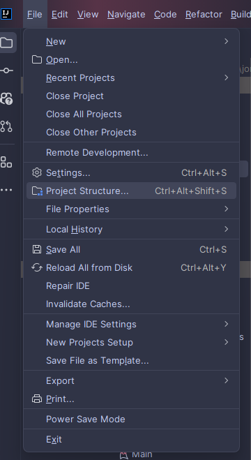
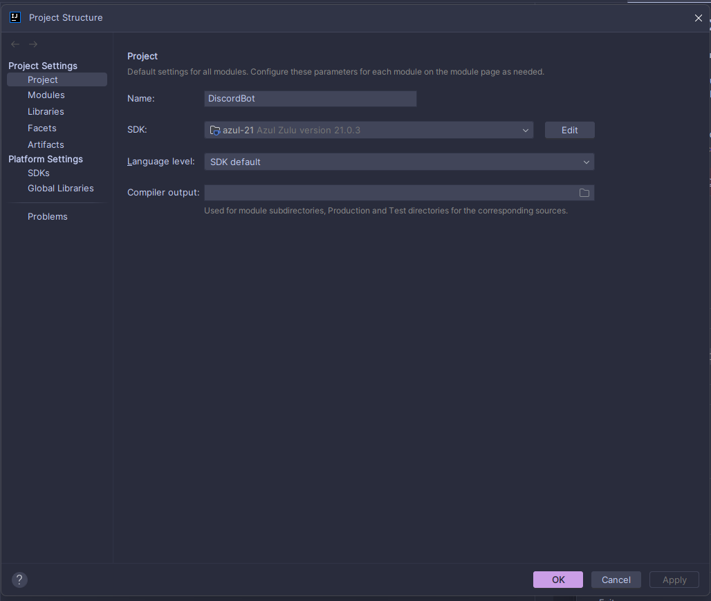
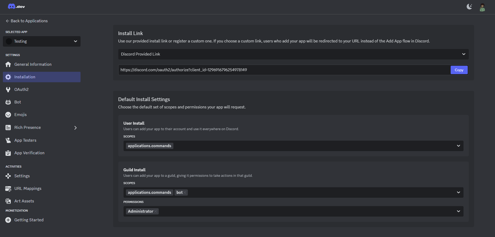

# How to run this project

Once you've got your project setup, you'll probably want to run it.

Before being able to run this project, you'll need to pick a project `SDK` (Software Development Kit), commonly
referred to as a `JDK` (Java Development Kit) in the context of the Java programming language.

Depending on how your IntelliJ looks, you'll need to navigate to project structure tab under `File` **(Try pressing `ALT + F` to get to this place!)**.

 

### Once you're in the project structure menu
Select `SDK:` and click `Download JDK`. Download the latest JDK from any source you'd like and ensure
you've selected it as your SDK. Once finished, click `OK` and IntelliJ should start indexing the project.

### Getting a Discord Application setup.

Head over to the [Discord developer portal](https://discord.com/developers/applications) and
create a new application.

Make sure you have a server setup to test this bot with. If you don't already have one, go ahead and create one.
After ensuring you have a testing environment, we need to invite your bot to your server.
Go over to the `Installation` tab on the developer portal for your application and go to the **Guild Install** section at the bottom of the page.

Add `bot` to the `SCOPES` field and `Administrator` for the `PERMISSIONS` field or whatever permissions you desire for your bot.
Afterward, scroll up to the **Install Link** field and copy the provided link. Paste the link in your browser
and follow the instructions for inviting the bot to your server.

### Getting your bot token

Head over to the `Bot` tab on the developer portal for you application. Click the `Reset Token` button for your bot.
Once you've acquired your token, store it in a safe place in case you need it again.

Once you've gotten your bot token, copy the Run configuration shown below