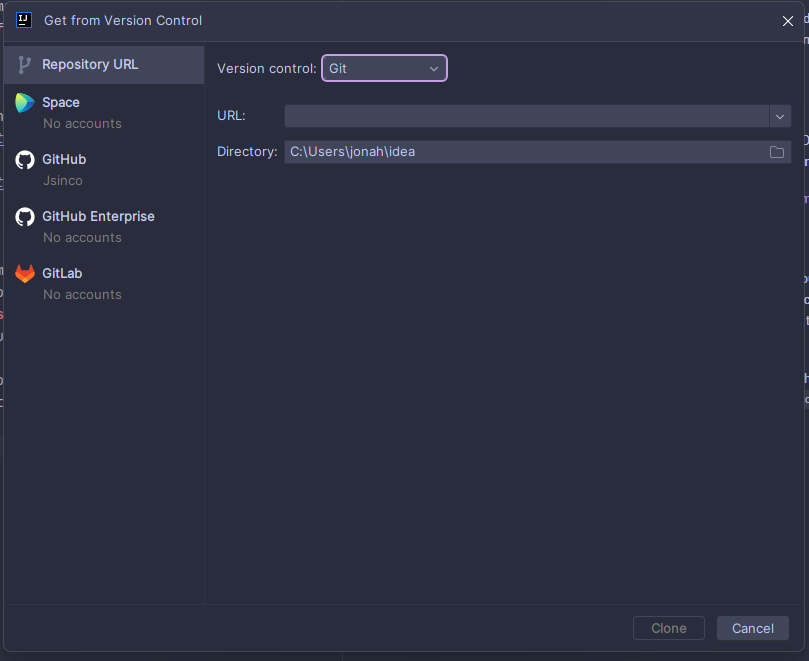

# Hi, let's get started.

New to programming? Let's get set up with an IDE.
IDE stands for Integrated development environment. 
You can think of this like photoshop, but for programmers.
Or a really fancy notepad with lots of nice features for coding.

## Downloading IntelliJ IDEA
Since this project is written in Java, we'll use an intuitive IDE called IntelliJ IDEA.
Head over to Jetbrains [download link](https://www.jetbrains.com/idea/download/) for IntelliJ and **ensure you scroll down and get the community edition**.

Prefer videos? Go ahead and watch a tutorial here: https://www.youtube.com/watch?v=viNG3VVnzFE

## Cloning our project from GitHub
Alright, now that you have IntelliJ installed it's time to `clone` our project.
You'll hear this word pop up pretty frequently when you get further into programming. **`Cloning`
is the act of copying a remote repositories files.** - To put this a bit more simply, you're copying
all the files from our Discord bot repository onto your computer, so you can edit them.

IntelliJ makes it super simple to clone projects and open them. Navigate to the
`Get from Version Control` button. It should say something like... `Get from VCS`, `New Project from VCS`, `New Project from Version Control`
or something similar.

Once you open up this menu, it should already be tabbed to `Repository URL` and `Version control: Git`

In the URL box, paste in the git URL from the remote repository. It should be `https://github.com/Coding-Club-HCC/DiscordBot.git`.
You can also get this link by going to the [repository](https://github.com/Coding-Club-HCC/DiscordBot) on GitHub and clicking the `Code` button.

Once pasted, click `Clone` and IntelliJ will start cloning the project.

* Can't figure it out based on the steps provided? Try watching this video: https://www.youtube.com/watch?v=aBVOAnygcZw

> Don't understand the steps provided? Let me know in our Discord (@jsinco)

### Author: Jonah
### Doc Since: 1.0