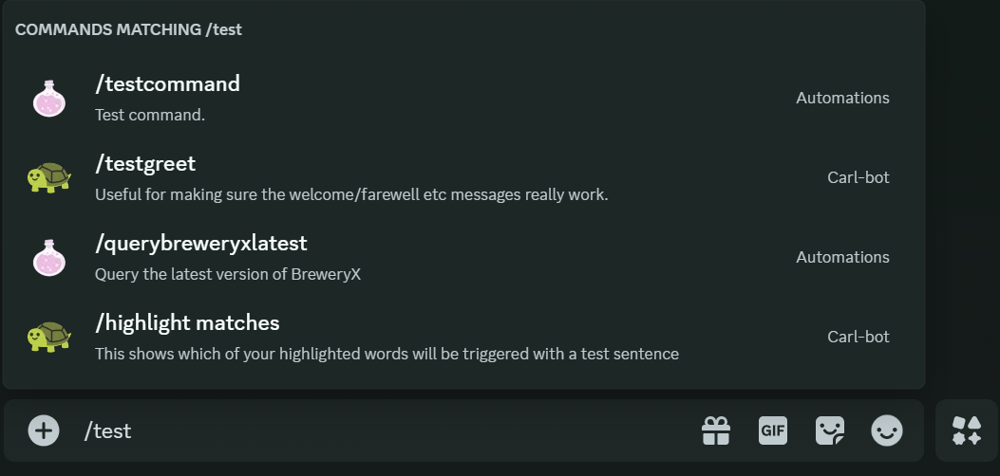
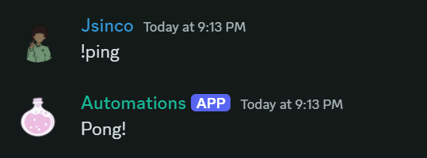

# How to write modules

### What are modules?
Modules are types of interactions a normal Discord bot can have.
Currently, there are 2 types of modules: Commands and Events.

### Commands

Commands are simple Discord commands, they look like this 
And may have additional options or arguments.

### Writing a Command Module
To write a command module, you must have a class which implements the `CommandModule` Interface and annotate it with `@DiscordCommand`

```java
import dev.jsinco.discord.commands.CommandModule;
import dev.jsinco.discord.commands.DiscordCommand;
import net.dv8tion.jda.api.events.interaction.command.SlashCommandInteractionEvent;

@DiscordCommand(name = "testcommand", description = "Test command.")
public class TestCommand implements CommandModule {
    @Override
    public void execute(SlashCommandInteractionEvent event) {
        event.reply("Test").setEphemeral(true).queue();
    }
}
```

### Events

Events occur whenever a certain action is performed in Discord.
Bots can listen for many types of events. To find a list of all, see JDA's documentation.

### Writing an Event Module
To write an event module, you must have a class which implements the `EventModule` Interface and annotate it with `@SubscribeEvent`

```java
import dev.jsinco.discord.events.ListenerModule;
import net.dv8tion.jda.api.events.message.MessageReceivedEvent;
import net.dv8tion.jda.api.hooks.SubscribeEvent;

public class MessageListener implements ListenerModule {

    @SubscribeEvent
    public void onUserSendsMessage(MessageReceivedEvent event) {
        if (event.getAuthor().isBot()) {
            return;
        }
        
        // Sends a message in the channel saying "Pong!" when a user sends "!ping"
        if (event.getMessage().getContentRaw().equalsIgnoreCase("!ping")) {
            event.getChannel().sendMessage("Pong!").queue();
        }
    }
}
```

